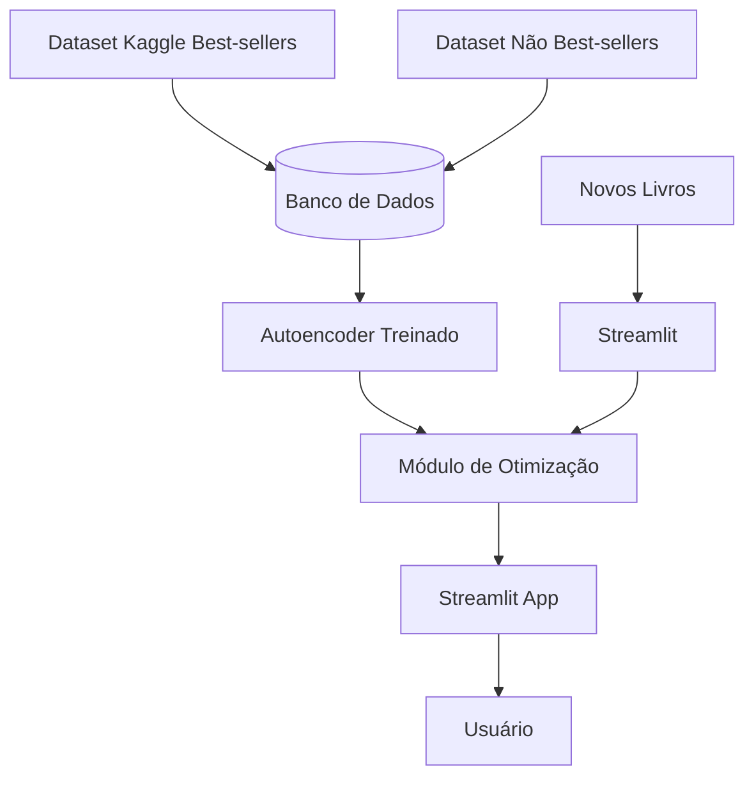

# BestSeller Value Advisor

Este projeto utiliza Inteligência Artificial, especificamente um **autoencoder**, para recomendar o preço ideal e prever em quantos anos (de 0 até 10 anos) um livro tem potencial de se tornar best-seller, com base em padrões aprendidos de livros best-sellers da Amazon entre 2009 e 2019.

---

## Visão Geral

O projeto segue estas etapas principais:

O fluxo principal do projeto é:

1. **Treinamento do Autoencoder**: aprende padrões a partir do dataset de livros best-sellers (Amazon 2009–2019). O objetivo é capturar o “padrão” de livros que se destacaram no mercado.
2. **Validação**: verifica o desempenho com livros que não são best-sellers, confirmando que apresentam erro maior de reconstrução.
3. **Configuração**: para novos livros é definido um **preço mínimo**, um intervalo de possíveis preços (do preço mínimo até o preço máximo) e uma variação de “ano futuro” de 0 a **Ano Limite**, em que **0 = ano atual**, **1 = daqui a 1 ano** e assim por diante
4. **Otimização**: realiza até 100 testes ajustando preço (entre um valor mínimo e até 3 vezes este valor) e ano futuro (0 até 10 anos à frente).
5. **Avaliação**: se pelo menos "n" combinações tiverem um erro de reconstrução menor que o **threshold selecionado** (por exemplo a média observada nos best-sellers), o livro **tem potencial** de se tornar best-seller. Caso contrário, “descartamos” esse livro.

---

## Base de Dados

1. **Dataset Principal (Best-sellers)**  
   - Fonte: [Amazon Top 50 Bestselling Books 2009–2019](https://www.kaggle.com/datasets/sootersaalu/amazon-top-50-bestselling-books-2009-2019).  
   - Atributos Principais:  
     - Nome do Livro, Autor, Avaliação do Usuário (Rating), Número de Resenhas (Reviews), Preço, Ano(s) em que foi best-seller, Gênero (Ficção ou Não-ficção).  
   - Usado para **treinar** o autoencoder e extrair o **erro médio** de referência.

2. **Dataset Secundário (Não Best-sellers)**  
   - Conjunto criado ou obtido manualmente de livros que **não** atingiram status de best-seller.  
   - Serve para **validação**: esperamos que o autoencoder apresente erros de reconstrução maiores para livros sem o “padrão” de sucesso.

---

## Arquitetura Geral

### Coleta e Armazenamento
   - Datasets armazenados em banco de dados.
   - Pré-processamento dos dados (limpeza e normalização).
        - Remover dos dados de entrada título e autor
   - Definir o banco (MySQL, PostgreSQL etc.)
   - Ajustar parâmetros de conexão no arquivo de configuração (.env ou settings.py). 

### Treinamento e Validação
   - Treinamento do autoencoder com o dataset principal.
   - Validação com o dataset secundário.

#### Entradas
   - Recursos dos livros (preço, avaliação, número de reviews, etc.).
#### Saída
   - Reconstrução dos mesmos recursos.
#### Objetivo
   - Aprender o “espaço latente” que descreve um best-seller, minimizando o erro de reconstrução.
   - Após o treinamento, sabemos o erro médio de reconstrução do dataset de best-sellers.
   - Validação com Dataset de Não Best-sellers
   - Avaliamos o modelo no conjunto de livros que não tiveram sucesso.
   - Esperamos que o erro de reconstrução seja maior (em média), pois eles não seguem o “padrão” de um best-seller.


### Módulo de Otimização
   - Ajusta preço e ano futuro em testes iterativos.
   - Avalia combinações e identifica potencial de best-seller.

#### Entrada
   - livro “novo” (com certos atributos: título, autor, rating inicial, reviews, gênero (ficção ou não ficção))
   - Preço mínimo (entrada do usuário ou default)
   - Preço máximo (Opcional)
   - Intervalo de anos para teste (por exemplo, 2009 a 2025, ou 2009 a 2019, dependendo das regras do negócio) (Opcional)
#### Saída
   - Conjunto de y linhas da reconstrução da entrada
#### Objetivo
   - Gerar tabela de valores com n valores respeitando o intervalo
   - Fazer a combinação da tabela de valores com a tabela de anos para se tornar um bestseller (n valores x r intervalo de anos)
   - Filtrar tabela de valores x Ano para restar apenas y linhas para serem processadas  

### Módulo de Análise e Avaliação
   - Calcular o erro de reconstrução
   - Retornar se o livro tem potencial para ser um **best-seller**
   - Retornar o melhor resultado da combinação, a média dos 5 melhores resultados e gráficos do resultado.

#### Entrada
   - Conjunto de y linhas da reconstrução da entrada
#### Saída
   - Resultado e gráficos
#### Objetivo
   - Gerar tabela de valores com n valores respeitando o intervalo
   - Fazer a combinação da tabela de valores com a tabela de anos para se tornar um bestseller (n valores x r intervalo de anos)
   - Filtrar tabela de valores x Ano para restar apenas y linhas para serem processadas  


### Interface Web (Streamlit)
   - Permite inserir novos livros e preço mínimo.
   - Executa otimização e exibe análises e resultados.
   - Apresentar resultados
   - Permite inserir um novo livro (informações principais, preço mínimo etc.).
   - Executa o processo de iteração e retorna a “recomendação” (livro apto ou descartado).
   - Exibe também análises exploratórias (EDA) do dataset de best-sellers (distribuições de preços, anos, ratings, etc.).

#### Entrada
   - Novo livro
   - Valor mínimo
   - Valor máximo (Opcional)
   - Período de anos (Opcional)
#### Saída
   - Resultado do módulo de Análise e Avaliação apresentado na interface
#### Objetivo
   - Interação com o usuário
---

### Diagrama Simplificado

            [ Kaggle Best-sellers ]   [ Não Best-sellers ]       [ Novos Livros ]
                     |                        |                         |
                     | (import/load)          |                         |
                     v                        |                         v
              [Banco de Dados]     <---       +                    [Streamlit]  --->  (CRUD / Inserção de Novos Livros)
                     ^
                     | (treino/validação)
                     v
               [ Autoencoder Treinado ]
                     ^
                     | (nova entrada)
                     |  ( 100 tentativas de preço + ano futuro)
                     v
              [ Módulo de Otimização ]
                     ^
                     | (resultado do erro)
                     |
                [ Streamlit App ]
                     ^
                     | (usuário)
                     |
                  [Novo Livro]



---

## Tecnologias Utilizadas

- **Python 3.x**  
- **Bibliotecas de Data Science / ML**:  
  - `pandas`, `numpy`, `scikit-learn` ou outra lib de Machine Learning.  
  - `tensorflow` ou `pytorch` (para o autoencoder).  
- **Streamlit** para interface web.  
- **Banco de Dados**: Pode ser **MySQL**, **PostgreSQL**, **MongoDB**, etc.  
- **Bibliotecas de visualização**: `matplotlib` (para gráficos).

---

## Estrutura de Diretórios

```
bestseller-value-advisor/
├── data/
│   ├── raw/                                      # Dados originais que o usuário pode enviar
│   │   ├── best_sellers.csv                      # (Exemplo) Dataset original do Kaggle
│   │   └── not_best_sellers.csv                  # (Exemplo) Dados complementares
│   │   └── not_table_validate.csv                # (Exemplo) Tabela não validada de dados
│   └── processed/                                # Dados processados/logs temporários
│                                                 # (podem ser limpos a qualquer momento)
│
├── services/
│   ├── backend/
│   │   ├── model_training/
│   │   │   ├── src/
│   │   │   │   ├── model/                        # Código da arquitetura do modelo
│   │   │   │   │   └── autoencoder.py            # Definição do modelo em si
│   │   │   │   └── train.py                      # Pipeline de treinamento principal
│   │   │   ├── trained_models/                   # Modelos treinados salvos (artefatos)
│   │   │   ├── Dockerfile
│   │   │   ├── requirements.txt
│   │   │   └── tests/                            # Testes focados em treinamento
│   │   │       └── test_training.py
│   │   │
│   │   ├── inference/
│   │   │   ├── src/
│   │   │   │   └── inference.py                  # Rotina de inferência (preço, ano, etc.)
│   │   │   ├── Dockerfile
│   │   │   ├── requirements.txt
│   │   │   └── tests/                            # Testes focados em inferência
│   │   │       └── test_inference.py
│   │   │
│   │   ├── data_ingestion/ (opcional)            # Exemplo: serviço de ingestão de dados
│   │   │   ├── src/
│   │   │   │   └── ingest_data.py                # Leitura do CSV e inserção no DB
│   │   │   ├── Dockerfile
│   │   │   ├── requirements.txt
│   │   │   └── tests/
│   │   │       └── test_data_ingestion.py
│   │   │
│   │   ├── schemas/                              # Schemas de validação (pydantic, marshmallow, etc.)
│   │   ├── trained_models/                       # Modelos treinados salvos (artefatos)
│   │   │   ├── scaler/                           # Scalers, transformações serializadas
│   │   │   ├── model/                            # 
│   │   │   └── analyse/                          # 
│   │   ├── scripts/                      # Scripts auxiliares (ex: data cleaning)
│   │   │   └── data_cleaning.py
│   │   ├── Dockerfile (opcional, caso queira empacotar todo o backend)
│   │   └── tests/                                # Testes gerais do backend (separados ou integrados)
│   │       └── test_backend.py
│   │
│   ├── database/
│   │   ├── scripts/
│   │   │   ├── init.sql                          # Script de criação de tabelas
│   │   │   └── seed.sql                          # Script de "seed" inicial
│   │   ├── db_connection.py                      # Módulo de conexão/configuração do DB
│   │   ├── README.md                             # Instruções de uso do DB
│   │   └── tests/
│   │       └── test_database.py
│   │
│   ├── frontend/
│   │   ├── src/
│   │   │   ├── streamlit_app.py                  # Aplicação Streamlit
│   │   │   └── pages/
│   │   │       ├── 1_Nova_Inferencia.py
│   │   │       ├── 2_Treinar_Modelo.py
│   │   │       └── 3_Inserir_CSV.py
│   │   ├── public/                               # Arquivos estáticos (se necessário)
│   │   ├── tests/
│   │   │    └── test_streamlit.py
│   │   ├── Dockerfile
│   │   ├── requirements.txt
│   │   └── README.md
│   │
│   ├── config/
│   │   ├── settings.py                           # Configurações globais de ambientes
│   │   └── .env.example                          # Exemplo de variáveis de ambiente locais
│   │
│   └── tests/                                    # (Opcional) Se quiser agrupar testes de "nível de serviço"
│       └── test_services_integration.py
│
├── .env                                          # Arquivo de variáveis de ambiente global (ex. p/ docker-compose)
├── docker-compose.yml                            # Orquestração dos vários containers (DB, backend, etc.)
├── README.md                                     # Documentação principal do projeto
├── .gitignore
└── .dockerignore
```

---

## Guia de Instalação e Execução

### Clonar o Repositório
   ```bash
   git clone https://github.com/seu-usuario/bestseller-value-advisor.git
   cd bestseller-value-advisor

### Ambiente Virtual (Poetry) (Rodar local)
```bash
poetry install
poetry shell
```

---
## Execução com Docker

O projeto utiliza quatro containers Docker:

- **Container de Modelo**: cria, treina e analisa o modelo quando solicitado.
- **Container Streamlit**: aplicação frontend.
- **Container Banco de Dados**: armazenamento dos datasets.
- **Container Inferência**: realiza previsões e otimizações sob demanda.

Containers de inferência e treinamento são levantados sob demanda e desligados após execução.

### Levantar Containers

```bash
docker-compose up -d streamlit db
```

### Gerar Modelo (sob demanda)

```bash
docker-compose run --rm modelo
```

### Inferência (sob demanda)

```bash
docker-compose run --rm inferencia
```

---

### Fluxo Gerar Modelo Autoencoder

1. **Preprocessar os Dados**

Verifique se best_sellers.csv e not_best_sellers.csv estão em data/raw/.

2. **Executar a Aplicação (Streamlit)**

Inicializar docker-compose da aplicação
bash
Copiar
Editar
streamlit run src/app/streamlit_app.py

Acesse o endereço local (geralmente http://localhost:8501) e utilize a interface para inserir novos livros e verificar a recomendação.

3. **Preprocessar os Dados**

Execute scripts ou notebooks de limpeza e normalização, e armazene em data/processed/.

3. **Selecionar Gerar Modelo**

Ao selecionar a opção de gerar modelo, o fluxo irá Executar o notebook ou script responsável pelo treinamento (notebooks/autoencoder_training.ipynb ou src/model/autoencoder.py).

4. **Salvar Modelo**

Certificar-se de salvar o modelo treinado (por ex. model/best_seller_autoencoder.h5).

### Fluxo de Otimização (Preço + Ano Futuro)

Ao inserir um livro (fornecendo título, autor, rating etc.), o sistema:

Pede preço mínimo.

Gera até 100 combinações no intervalo [preço_mínimo, 3 × preço_mínimo] para preço e [0, 10] para “ano futuro”.

Calcula o erro de reconstrução em cada caso.

Se ≥ 20 dessas combinações tiverem erro abaixo do erro médio de reconstrução dos best-sellers, o livro é considerado “Apto a se tornar Best-seller”. Senão, “Descartado”.

---

## Próximos Passos
- Refinar a Métrica de Erro
- Decidir se o threshold será o erro médio + desvio padrão, mediana, ou se usaremos quartis.
- Ajustar hiperparâmetros do autoencoder para melhorar a distinção entre best-sellers e não best-sellers.
- Implementar Otimizações Mais Eficientes
- Ao invés de 100 tentativas aleatórias, poderemos usar algoritmos de busca ou heurísticas para encontrar o preço ótimo mais rapidamente.
- Adicionar Visualizações
- Criar gráficos no Streamlit para visualizar: distribuição dos preços, avaliações, número de reviews vs. erro de reconstrução.
- Tornar o Dataset Secundário Mais Rico
- Buscar ou criar mais exemplos de livros que não foram best-sellers, garantindo uma boa representatividade do mercado.
- Expandir dataset secundário.

---


## Licença

Este projeto está licenciado sob a [MIT License](LICENSE).
